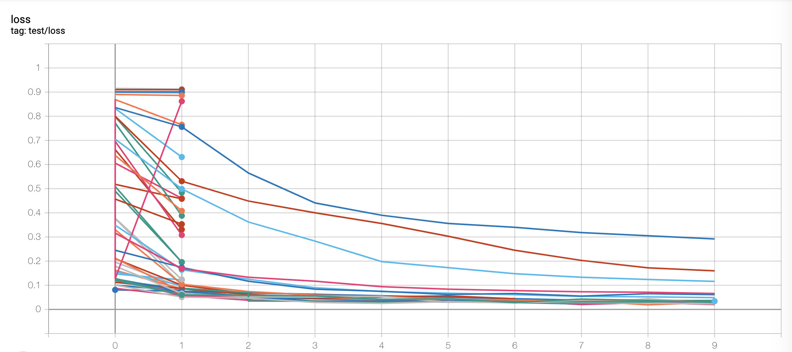

# Example Optuna with MySQL on Docker

### Results mnist(train size 6000) with pytorch on epoch 10




## How to use?

```bash
# create env
docker-compose up -d
docker exec -it optuna_pytorch /bin/bash
# run
python main.py

# remove env
exit
docker-compose down
```


## Check results in MySQL 

```
# on host
# install mysql
brew install mysql

# check tables on Optuna db
mysql -h 127.0.0.1 --port 3306 -uroot -proot -D optuna -e 'show tables'

# check results on Optuna db
mysql -h 127.0.0.1 --port 3306 -uroot -proot -D optuna -e 'select * from trials'
```


## Check on tensorboardX

 ```
# on host
docker exec -it optuna_pytorch /bin/bassh
tensorboard --logdir runs

# access to http://localhost:6006/#hparams on browser
 ```


## Remove results

```
mysql -h 127.0.0.1 --port 3306 -uroot -proot -D optuna -e 'drop database optuna'
```

